# Apature UI Graph — Architecture

Created: 2026-06-16
Revised: 2026-06-18
Status: normative representation-layer architecture

## 1. Architecture Summary

UI Graph is a deterministic package inside the Judgment Engine processing boundary. It receives authorized, versioned observations; emits an immutable content-addressed graph; and renders task-focused views. It does not capture a browser, invoke a model, act on a UI, store canonical UI DNA, or deliver product findings.

The architecture separates:

- evidence production;
- representation and compression;
- model judgment;
- product workflow and action.

## 2. System Boundary

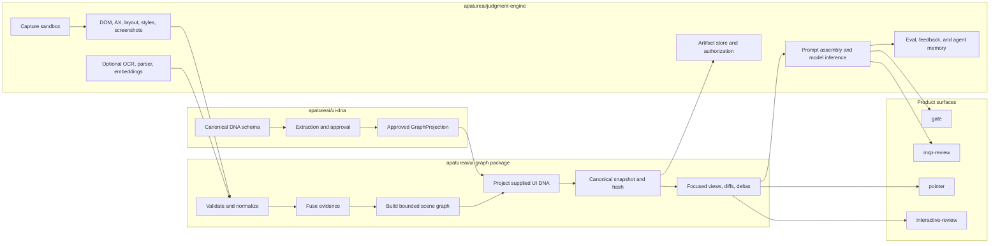

Hard boundary:

- optional parser/embedding arrows enter UI Graph as data;
- UI Graph has no outgoing call to a model or browser;
- products receive views through their owning service boundary, not unrestricted artifact-store access.

## 3. Component Model

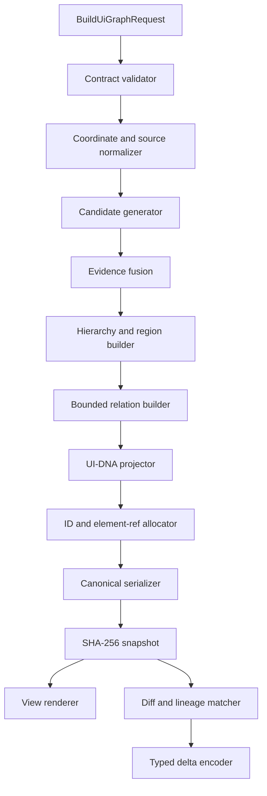

All stages are deterministic for byte-identical normalized inputs and versioned policies.

## 4. Build Sequence

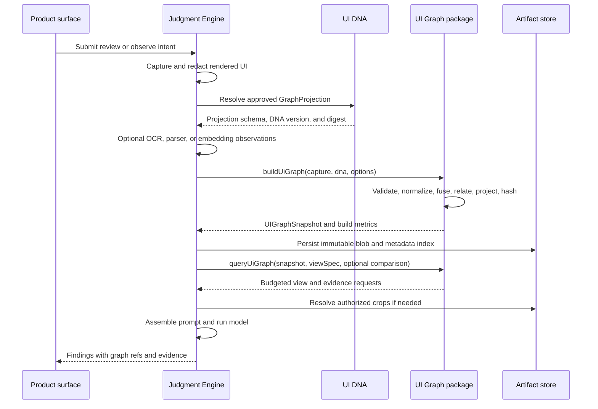

UI Graph is called after capture and before inference. It does not change the asynchronous Judgment Engine job contract.

## 5. Data Flow and Trust Labels

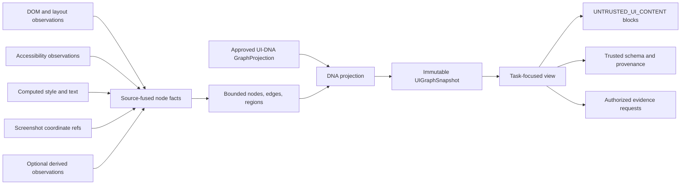

Trust rules:

- schema, policy versions, and builder-generated provenance are trusted control data;
- DOM, AX, OCR, parser labels, and visible text are untrusted customer/page data;
- production DNA is authoritative only when supplied through the approved projection contract; non-canonical eval fixtures remain advisory;
- evidence artifacts remain protected resources, not embedded trust.

## 6. Canonical Snapshot and Query Views

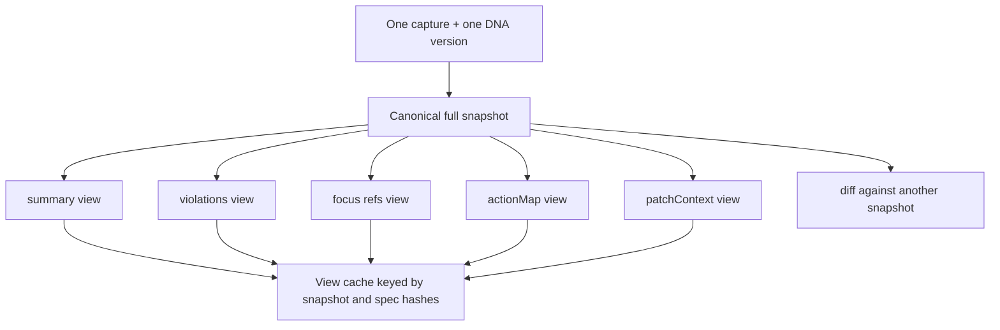

The full snapshot is reusable and task-neutral. Views are lossy, budgeted, and versioned.

## 7. Evidence Fusion

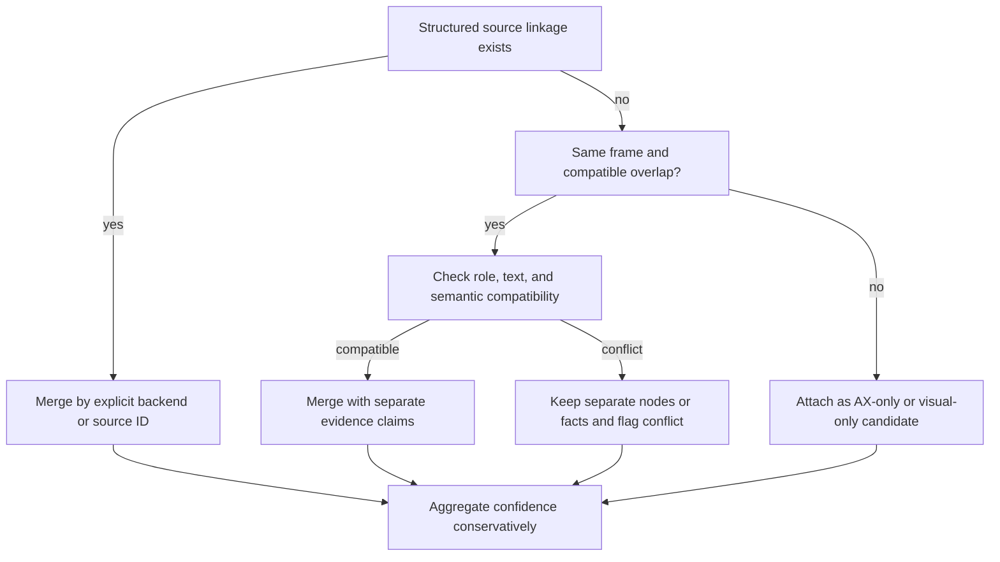

Source competence:

| Fact | Preferred evidence | Fallback |
|---|---|---|
| Accessible role/name/state | Accessibility tree | DOM semantics, parser label |
| Geometry and clipping | Layout/DOM snapshot | Parser box |
| Paint/stacking | Layout/paint snapshot | Pixel evidence |
| Computed typography/color | Computed style | Pixel/OCR observation as advisory |
| Canvas/image-only elements | Parser/OCR observation | Document-level visual region |
| Canonical token/rule | UI DNA | `unknown` |

No source globally outranks another.

## 8. Stable References and Lineage

### 8.1 Snapshot-local refs

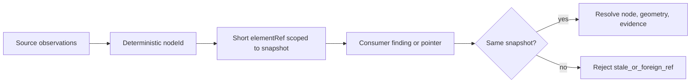

### 8.2 Cross-snapshot lineage

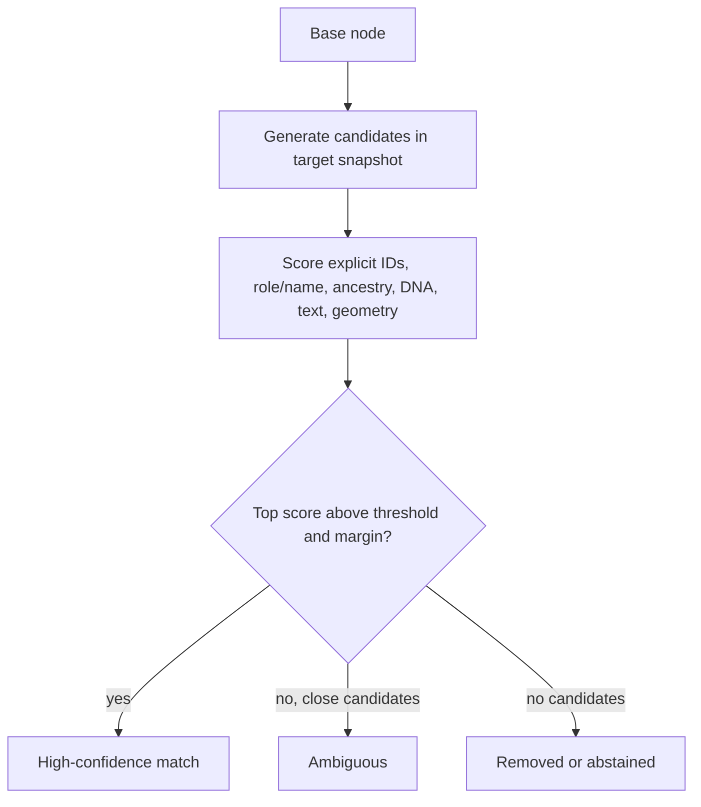

The architecture intentionally separates citation identity from cross-capture matching. A wrong stable ref is more damaging than a missing match.

## 9. Storage Architecture

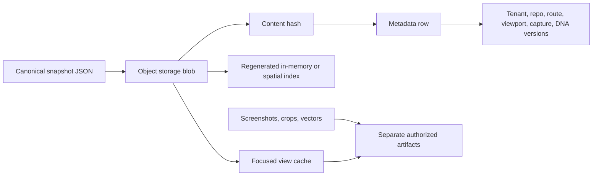

MVP storage:

- immutable JSON blob in Judgment Engine’s object store;
- metadata/index row in its operational database;
- optional regenerated spatial/text index;
- no canonical graph database;
- no signed or expiring URL inside graph content.

Why:

- snapshots are immutable and naturally content-addressed;
- evaluation needs reproducible frozen artifacts;
- dominant queries are bounded to one snapshot;
- a graph database adds a stateful service before cross-snapshot traversal is proven necessary.

## 10. Delta and Live Observation Flow

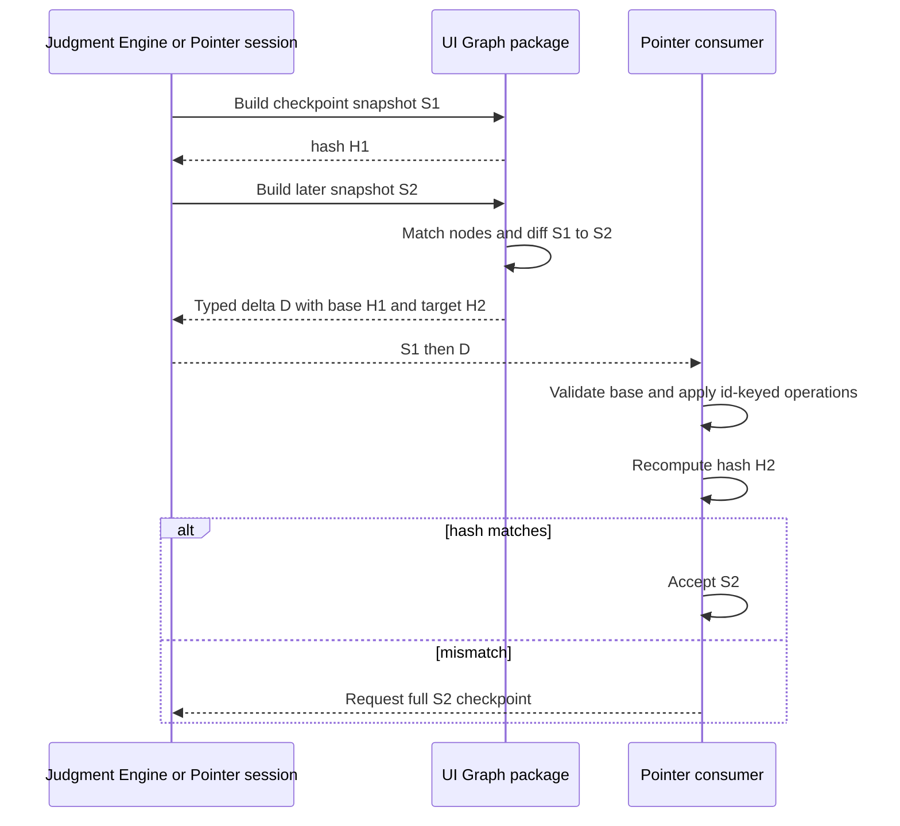

Deltas optimize transfer and repeated observation. They do not replace full snapshots or create an event-sourced ownership layer.

## 11. Prompt View and Pixel Escalation Flow

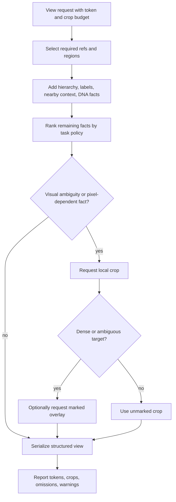

The renderer recommends evidence. Judgment Engine decides whether a crop enters a model call.

## 12. Security and Privacy Data Flow

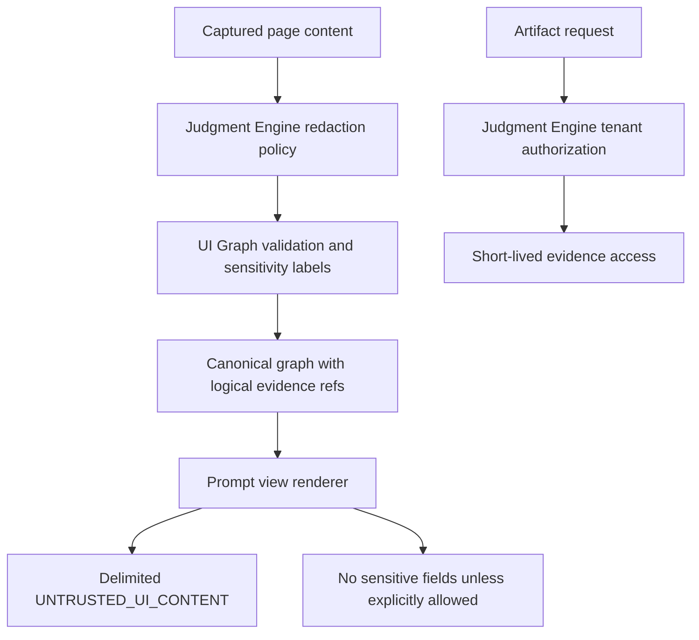

Defense-in-depth:

- upstream redaction before graph build;
- graph-level sensitivity labels and fail-closed rendering;
- provenance preserved for injection analysis;
- tenant authorization remains outside the graph package;
- no page content can grant itself higher trust.

## 13. Failure and Degradation Matrix

| Condition | UI Graph behavior | Consumer implication |
|---|---|---|
| Screenshot unavailable | Structured graph succeeds with warning | No pixel escalation |
| DOM/layout unavailable | Use AX/derived observations if present | Lower geometry confidence |
| AX unavailable | Structural/visual graph succeeds | Accessible semantics partial |
| Styles unavailable | No style/DNA drift certainty | Use `unknown`, not default values |
| UI DNA unavailable | Neutral graph | No design-conformance claim |
| Non-canonical DNA fixture in authorized eval | Force all matches non-authoritative | Never use for published production findings |
| Parser conflicts with DOM | Preserve both; parser remains advisory | Crop may be required |
| Capture unstable | Carry page-health warning | Judgment Engine applies confidence policy |
| Node/edge budget exceeded | Summarize/drop low-value non-structural detail | View reports truncation |
| Ref from another snapshot | Typed rejection | Requery or lineage-match |
| Delta hash mismatch | Reject target | Fetch full checkpoint |
| Sensitive content survives policy | Prompt rendering fails closed | Do not invoke model with that view |

## 14. Architecture Decision Records

### ADR-001 — Hybrid scene graph

Status: accepted

Context: AX/DOM is efficient and actionable but visually incomplete. Screenshot-only perception captures rendered truth but is expensive and weakly linked to source/UI DNA.

Decision: fuse structured observations into the canonical graph and retain pixel evidence by reference. Ingest optional parser/OCR observations only as supplied data.

Rejected:

- AX-only as canonical representation;
- screenshot-only as default;
- UI Graph-owned parser inference.

Experiment gate: R1 baseline comparison in `RESEARCH.md`.

### ADR-002 — Library inside Judgment Engine for MVP

Status: accepted

Context: a dedicated service would add network latency, auth, tenancy, deployment, and availability concerns before independent scaling is demonstrated.

Decision: ship a deterministic versioned package called by Judgment Engine.

Migration trigger: multiple independently deployed consumers require direct graph access or the package cannot meet isolation/scaling needs.

### ADR-003 — Immutable blobs plus derived indexes

Status: accepted

Context: graphs are per-capture, immutable, and queried locally. Evaluation requires frozen content-addressed artifacts.

Decision: store canonical JSON blobs and metadata/spatial indexes in Judgment Engine infrastructure.

Rejected: graph database as MVP source of truth.

Migration trigger: measured cross-snapshot traversal workload and lower total operational cost.

### ADR-004 — Deterministic persisted relations

Status: accepted

Context: learned visual grouping may improve recall but creates model/version/calibration and ownership concerns.

Decision: persist deterministic bounded relations. Learned relations are optional advisory evidence from an upstream provider.

Migration trigger: controlled experiment shows significant quality lift after latency and calibration cost.

### ADR-005 — Full snapshot, focused query-time views

Status: accepted

Context: task-specific graphs are not reusable; precomputing all views is combinatorial.

Decision: build one task-neutral full snapshot and render bounded views on demand.

Rejected: raw full graph in every prompt.

### ADR-006 — Structured UI-DNA matching before embeddings

Status: accepted

Context: exact token and rule matches are auditable; embedding similarity is useful but non-authoritative.

Decision: deterministic matches can be authoritative against approved DNA. Embeddings retrieve advisory candidates only.

Migration trigger: R6 demonstrates precision/accepted-finding gain.

### ADR-007 — Snapshot refs plus probabilistic lineage

Status: accepted

Context: selectors and browser node handles are not reliably stable across renders.

Decision: use opaque snapshot-scoped refs and separately score cross-snapshot candidates with abstention.

Rejected: claiming CSS/XPath/CDP/AX IDs are durable product identity.

### ADR-008 — Typed graph deltas

Status: accepted

Context: JSON Patch is generic, but array-index paths are brittle for canonically sorted graph collections.

Decision: use typed ID-keyed operations plus explicit header replacement with base/target schema versions and hashes; store full checkpoints.

### ADR-009 — Compression under quality constraints

Status: accepted

Context: minimum tokens alone can remove grounding-critical pixels or text.

Decision: optimize tokens, bytes, crops, latency, and cost subject to grounding and finding-quality retention gates.

Rejected: compression ratio as the sole KPI.

### ADR-010 — Agent memory remains external

Status: accepted

Context: UI Graph can expose snapshots, diffs, and lineage but should not own long-term beliefs, preferences, or feedback.

Decision: Judgment Engine owns per-repo memory and feedback. UI DNA owns canonical design intent. UI Graph provides representation artifacts they may reference.

Snapshot and delta IDs are evidence references for memory systems, not memory records. Retention, summarization, retrieval ranking, and learning from outcomes remain outside this package.

## 15. Rollout Architecture

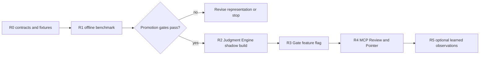

Every rollout stage retains a full-context fallback until the next stage’s quality and security evidence is established.

## 16. Repository Ownership Matrix

| Repository | Owns | Must not delegate to UI Graph |
|---|---|---|
| `apatureai/core` | Company thesis and product sequencing | Representation implementation details |
| `apatureai/judgment-engine` | Capture, artifact storage, inference, validation, eval execution, feedback, memory, shared security | Canonical graph/schema semantics |
| `apatureai/ui-dna` | DNA schema, extraction, approval, versioned design genome | Per-capture rendered graph |
| `apatureai/ui-graph` | Representation schemas, deterministic builder/query/diff rules, refs, representation metrics | Capture, model calls, actions, canonical DNA, product delivery |
| `apatureai/gate` | GitHub orchestration and delivery | Shared graph internals |
| `apatureai/mcp-review` | Agent-facing review/recheck tools | Graph construction or browser action |
| `apatureai/pointer` | Live overlay/session UX | Canonical refs or capture/model substrate |

### 16.1 Integration readiness as of 2026-06-18

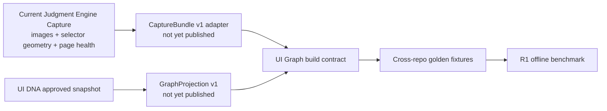

The contracts in this repository are target consumer contracts. They do not assert that the current producer repositories already emit them. Integration starts only after producer-owned schemas and golden fixtures are published and version-negotiated.

## 17. Open Architecture Questions

These remain experiment-gated:

- exact deterministic grouping algorithm and thresholds;
- tokenizer/model profiles used for cost estimates;
- crop padding and Set-of-Mark policy per model;
- cross-snapshot confidence calibration;
- whether graph JSON needs a compact binary transport after MVP;
- when, if ever, a graph database is operationally justified;
- whether externally learned relations or embeddings improve Apature design judgment.

None of these questions changes the layer boundary.
