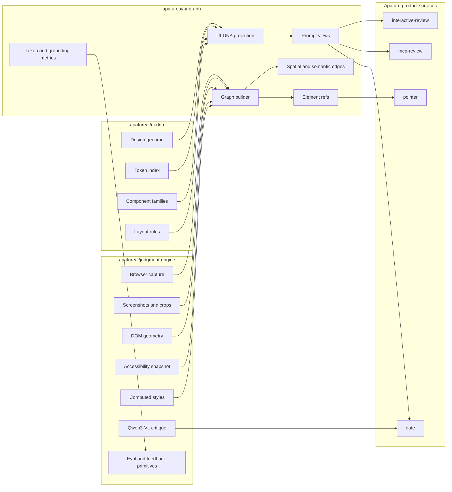
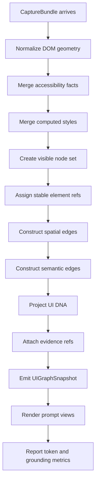
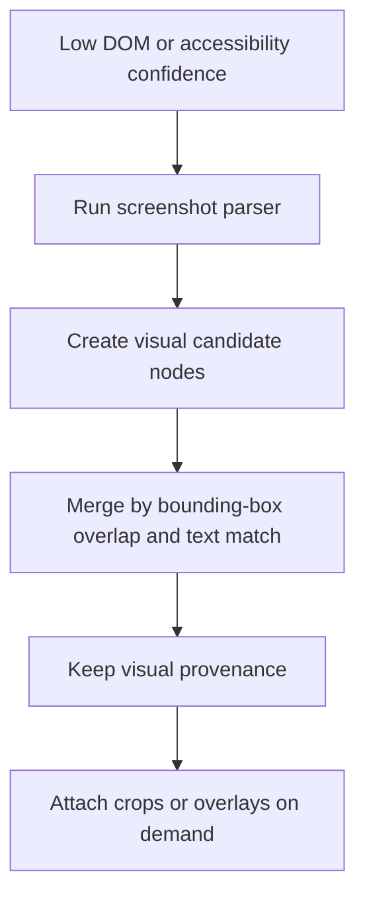
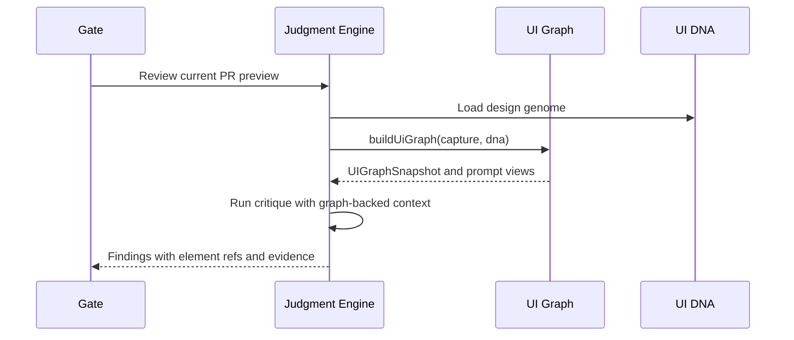
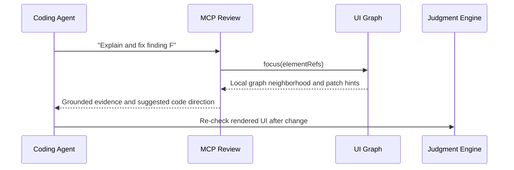
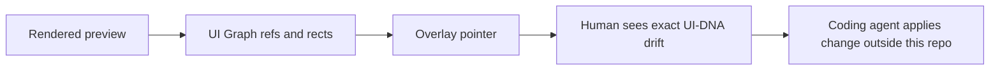
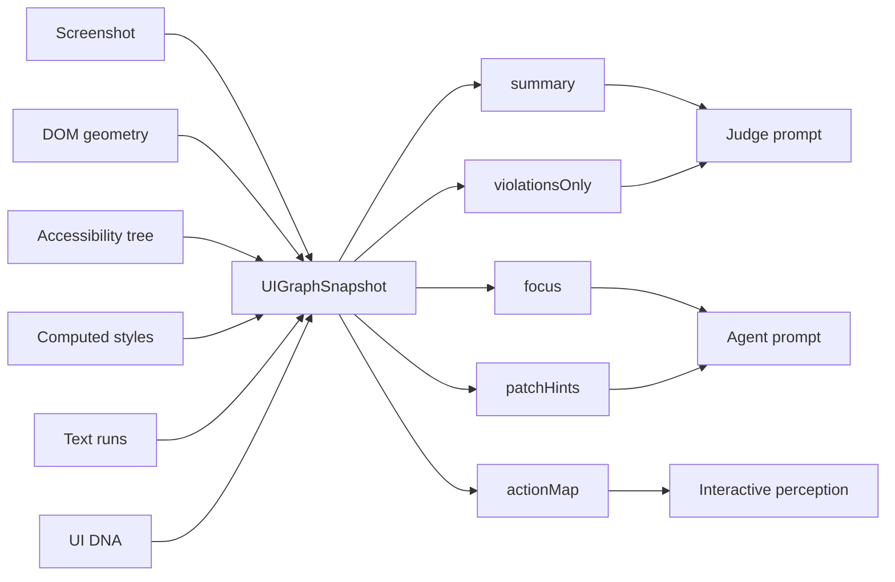

# Apature UI Graph Architecture

Created: 2026-06-16
Status: representation-layer architecture record

## 1. Architecture Summary

UI Graph sits between Apature's capture/model substrate and the product surfaces that need to understand rendered UI. It receives capture artifacts from `judgment-engine`, receives design standards from `ui-dna`, and emits compact graph snapshots and prompt views for Gate, MCP Review, Pointer, and later interactive surfaces.

It is a perception and representation layer. It does not own browser capture, model calls, GitHub delivery, billing, or code changes.

## 2. System Boundary



## 3. Build Flow



Optional visual parser branch:



## 4. Consumer Flows

### Gate



### MCP Review



### Pointer



## 5. Data Flow



Large artifacts stay behind refs. Prompt views contain compact text plus pointers to crops, overlays, and screenshots when needed.

## 6. Repo Ownership

| Repo | Owns | Does not own |
|---|---|---|
| `apatureai/ui-graph` | Graph schema, builder contract, prompt views, element refs, graph metrics | Capture, model calls, GitHub delivery, UI-DNA source of truth |
| `apatureai/judgment-engine` | Capture, model adapters, validation, eval, feedback, shared artifact store | Product-specific GitHub UX |
| `apatureai/ui-dna` | Design genome, token extraction, component families, design rules | Per-route rendered graph construction |
| `apatureai/gate` | PR review orchestration, sticky comment, Check Run, product packaging | Shared perception engine |
| `apatureai/mcp-review` | Agent-facing tools and workflows | Graph construction internals |
| `apatureai/pointer` | Live overlay and pointing surface | Model calls or graph schema authority |

## 7. Failure Modes

| Failure | UI Graph behavior |
|---|---|
| Capture bundle missing screenshot | Return no graph and explicit `missing_screenshot` reason |
| DOM and accessibility disagree | Keep both sources, lower confidence, require evidence refs |
| Computed styles unavailable | Build structural graph, mark design projection as partial |
| Too many nodes | Collapse repeated lists and low-salience children into regions |
| Visual parser disagrees with DOM | Preserve visual candidate as secondary evidence, do not override silently |
| Sensitive text detected | Redact in prompt views while preserving geometry |
| UI-DNA version missing | Build neutral graph without design projection |
| Prompt view exceeds budget | Drop low-salience nodes first and report truncation |

## 8. Architecture Poster

The poster source is `poster_ui_graph.html`.

Rendered artifact:

```text
ui_graph_architecture.png
```

Render rule:

- Open `poster_ui_graph.html`.
- Render at a 3020px-wide viewport.
- Screenshot the `.poster` element.
- Regenerate the PNG whenever the poster HTML or referenced icons change.
