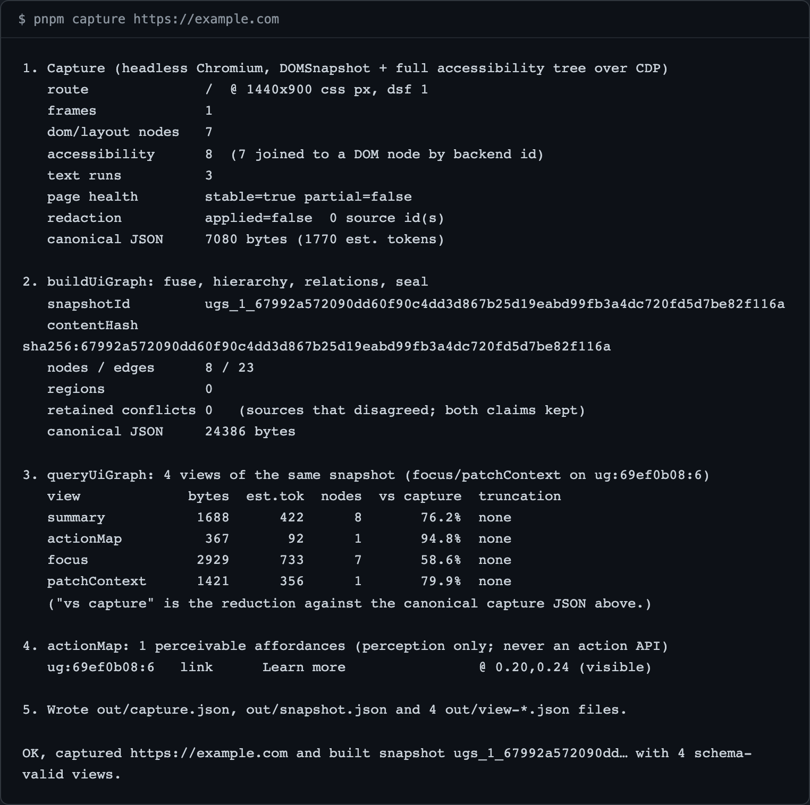

<div align="center">

<picture>
  <source media="(prefers-color-scheme: dark)" srcset="docs/assets/banner-dark.svg">
  
</picture>

<p>a scene graph that keeps its sources honest</p>

<p>
  <a href="https://www.npmjs.com/package/@apatureai/lattice"></a>
  <a href="https://github.com/apatureai/lattice/actions/workflows/ci.yml"></a>
  <a href="LICENSE"></a>
</p>

<p>Part of the <a href="https://github.com/apatureai">Apature stack</a> — automated design review for rendered UI. The <a href="https://github.com/apatureai/.github/blob/main/profile/README.md">org profile</a> maps how the pieces compose.</p>

</div>

<p align="center">
  
</p>

When the DOM says `link` and the accessibility tree says `button`, lattice keeps both claims on the node and flags the conflict — it fuses DOM/layout, accessibility, computed style and text-run capture into one immutable, content-addressed scene graph instead of picking winners, then renders small budgeted text views of it for a model prompt. It never edits code and never drives a UI: it navigates, waits and observes, and every fact in a view stays traceable to the source that produced it, through the same short ref the model was given. The graph library is pure TypeScript — JSON in, JSON out, no browser, no screenshots, no network — and a separate Playwright/CDP adapter, guarded in CI, is the only thing that ever touches a page.

It is for you if you are building a browser or computer-use agent and:

- flat accessibility-tree serialization is not working — too big, it loses geometry, and it silently drops the source disagreements that are the interesting part;
- you need the model's prompt small and bounded, and you need to know exactly what got dropped to make it fit;
- you need a claim the model makes about "that button" to resolve back to real evidence later — for a review comment, an assertion, or a human check;
- you want to bring your own capture layer (CDP, Playwright, an extension) or use the one in this repo.

## Quickstart

Node 24 and pnpm 9.15.0 (`corepack enable` installs the pinned pnpm). No command here needs credentials or an API key, and none accepts any.

From a clean clone, at the repo root:

```sh
pnpm install --frozen-lockfile
pnpm build
pnpm browser:install      # one-time Chromium download; skip it if you only want the library
pnpm capture https://example.com
```

`example.com` is seven elements, which is the point: it fits on the page. Swap it for any `http(s)://` or `file://` URL. The tail of the run:

```
4. actionMap: 1 perceivable affordances (perception only; never an action API)
   ug:69ef0b08:6   link      Learn more                @ 0.20,0.24 (visible)

5. Wrote out/capture.json, out/snapshot.json and 4 out/view-*.json files.

OK, captured https://example.com and built snapshot ugs_1_67992a572090dd… with 4 schema-valid views.
```

**Success criterion:** the last line reads `OK, captured <your url> and built snapshot … with N schema-valid views.`, and `out/` holds `capture.json`, `snapshot.json` and one `view-*.json` per view.

**No browser at all?** `node examples/quickstart.mjs` runs the whole pipeline against a deterministic synthetic capture (130 DOM nodes, no network), builds a sealed snapshot, and renders five views — including what a tight `maxTextTokens: 1000` budget drops from one of them. It writes the same seven JSON files to `out/`. If it exits with `ERR_MODULE_NOT_FOUND` for `packages/schema/dist/index.js`, you skipped `pnpm build`.

## What you get

The run writes seven files to `out/` and prints the shape of each. From the `example.com` capture above:

- **`out/capture.json`** — the evidence: 7 DOM/layout nodes, 8 accessibility nodes (7 joined to a DOM node by backend id), 3 text runs, canonical at 7080 bytes. This is what the graph was built *from*.
- **`out/snapshot.json`** — the sealed graph: `snapshotId` `ugs_1_67992a57…` and a matching `contentHash sha256:67992a57…`, 8 nodes / 23 edges, `retained conflicts 0`. Content-addressed, so the same page seals to the same id.
- **`out/view-{summary,actionMap,focus,patchContext}.json`** — four budgeted views of that one snapshot, each carrying `text`, `includedNodeIds`, `budget`, `truncation`, and a derived `viewId`/`specHash`. Open `out/view-actionMap.json` to see what a model would be told; open `out/capture.json` to see the evidence it was told from.

Two things in that output are what the repository is actually about.

**"7 joined to a DOM node by backend id."** The adapter reads `DOMSnapshot.captureSnapshot` and `Accessibility.getFullAXTree`, both keyed by the same backend node id, so fusion joins the two trees by explicit id rather than guessing from overlapping rectangles. That is what makes retained conflicts meaningful. The repository ships a denser fixture page with landmarks, a table, a form, an iframe and two deliberate source disagreements:

```
$ pnpm capture "file://$PWD/packages/capture/test/fixtures/page.html" --route /deployments
...
2. buildUiGraph: fuse, hierarchy, relations, seal
   nodes / edges      79 / 217
   regions            12
   retained conflicts 2   (sources that disagreed; both claims kept)
```

On that page a detached `<li>` and a `<summary>` disclosure widget are places where the DOM's implicit role and the accessibility tree genuinely disagree, and both claims survive onto one node instead of one quietly winning.

**The same page seals to the same `contentHash`.** Chromium's frame ids, backend node ids and accessibility node ids are per-session values that change on every launch; if they reached the bundle, an unchanged page would produce a new `snapshotId` every capture — the exact property content addressing exists to prevent. The adapter replaces them with capture-local ordinals, so two separate browser launches over the same page produce a byte-identical capture, and a live test asserts exactly that. (The id still moves across platforms, because text metrics do; treat it as stable for a given page and browser build, not as a universal fingerprint.)

## Token efficiency

The claim is that this representation is cheaper to put in a prompt than raw structured context. Here is the measurement, with the baseline being canonical JSON bytes of the whole capture bundle — three pages captured through `pnpm capture` on 2026-08-10 at 1440x900. The two live sites move; re-run and the numbers change, which is why the reproducible fixture page is the middle row.

| Page | DOM nodes | Capture bytes | `summary` | `actionMap` | `focus` | `patchContext` |
|---|---|---|---|---|---|---|
| `https://example.com` | 7 | 7080 | 1688 (76.2%) | 367 (94.8%) | 2929 (58.6%) | 1421 (79.9%) |
| the bundled fixture page | 74 | 74740 | 9760 (86.9%) | 2735 (96.3%) | 4143 (94.5%) | 1516 (98.0%) |
| `https://news.ycombinator.com` | 806 | 745445 | 61098 (91.8%) | 53942 (92.8%) | 8355 (98.9%) | 1467 (99.8%) |

Read these more carefully than the headline percentages invite:

- **The baseline is a verbose capture.** The adapter records 23 computed-style properties per node, because the point of the graph is to keep evidence rather than pre-decide what matters. That inflates the denominator and therefore every reduction figure; the honest comparison is the *view* against whatever structured context you would otherwise have pasted in.
- **A bounded view scales, a page summary does not.** `patchContext` about one element costs roughly the same 1.5 KB whether the page has 7 nodes or 806; `summary` grows with the page, which is why the smallest page shows the worst summary ratio and the largest the best.
- **`focus` on `example.com` is worse than its summary.** With eight nodes on the page, describing one node plus its neighbourhood is most of the page. Bounded views pay off on pages that have something to bound.
- **The `violations` view is missing from that table, and running it exposed a real problem** — on a poorly-matching projection it produced a 91909-byte view against a 74740-byte capture, larger than its own input. That is a known defect ([roadmap](docs/roadmap.md) item 2), not a headline number.

The synthetic-fixture measurements and the reduction-vs-capture table for the bounded views are in [`docs/token-efficiency.md`](docs/token-efficiency.md).

## Usage

Two packages, one boundary. **`@apatureai/lattice`** is the graph — a pure TypeScript library with four entry points (`buildUiGraph`, `queryUiGraph`, `diffUiGraphs`, `applyUiGraphDelta`), all synchronous except the builder. **`@apatureai/lattice-capture`** is the producer that feeds it — a Playwright/CDP adapter with three entry points (`captureUrl`, `captureFromPage`, `captureBundleFromCdp`). The browser lives in the adapter and nowhere else; [`scripts/capability-guard.mjs`](scripts/capability-guard.mjs) fails CI if that stops being true.

A URL to a sealed graph, then one budgeted view for the prompt:

```ts
import { captureUrl } from "@apatureai/lattice-capture";
import { buildUiGraph, queryUiGraph } from "@apatureai/lattice";

const capture = await captureUrl("https://example.com/deployments", {
  viewport: { width: 1440, height: 900, deviceScaleFactor: 2 },
  redactSelectors: ["[data-sensitive]"],
});
const { snapshot } = await buildUiGraph({ capture, options: { /* policy versions, budgets */ } });
const view = queryUiGraph({
  snapshot,
  spec: { kind: "focus", refs: ["ug:65bc9d34:2"], maxTextTokens: 4000, includeSensitive: false },
});
// view.text is the prompt payload; view.truncation says what was dropped
```

The CLI is the same pipeline: `pnpm capture <url> [options]` (`--viewport`, `--dsf`, `--wait-for`, `--redact`, `--dna <file>`, `--screenshot`, `--route`, …; `pnpm capture --help` lists them all). Passing `--dna <file>` against a UI-DNA projection enables the `violations` view; the repository ships a copyable one at [`examples/design-dna.json`](examples/design-dna.json).

The full API reference — every capture layer, all four graph entry points, the design-system `--dna` projection contract, and `diffUiGraphs`/`applyUiGraphDelta` — is in [`docs/api.md`](docs/api.md).

## Configuration

None. No environment variable is read anywhere in either package; `grep -rn "process.env" packages scripts examples` returns nothing. Everything is a function argument or a `pnpm capture` flag. Network is needed exactly twice — to install dependencies and to fetch Chromium once — and after that only the page you point the capture at is fetched; the graph library never opens a socket. Verified on macOS 15.6.1 and on `ubuntu-latest` in CI; Windows has not been tried.

## Design notes

The long-form design writing moved to `docs/` so the README stays scannable. Each file answers one question:

- [`docs/design-notes.md`](docs/design-notes.md) — the four ideas behind the design: fusing sources with provenance, content-addressed identity, a matcher that abstains, and budgeted fail-closed rendering.
- [`docs/how-it-works.md`](docs/how-it-works.md) — the build pipeline, the design-decision table, the capability boundary, degradation behaviour, and the directory map.
- [`docs/api.md`](docs/api.md) — the full capture and graph API surface, including the `--dna` design-system projection contract.
- [`docs/token-efficiency.md`](docs/token-efficiency.md) — the synthetic-fixture reduction measurements behind the headline table.
- [`docs/development.md`](docs/development.md) — running the suites, regenerating the hero, and the publishing/release process.
- [`docs/roadmap.md`](docs/roadmap.md) — full component status and the seven pickup-able roadmap items.

## Status

Version 0.1.1: the core is working and covered by 383 tests plus a live-browser suite; the edges are honest about what is missing. `buildUiGraph`, `queryUiGraph` (all six view kinds), lineage `diff`, typed deltas and canonical sealing are working. Design-system projection does token and numeric-scale matching only; the `violations` view has a known size defect on poorly-matching projections; both packages are published to npm at 0.1.1; and the pre-registered promotion gates stay fail-closed until a model consumer supplies runs. Full component table and the seven roadmap items: [`docs/roadmap.md`](docs/roadmap.md).

## Contributing

See [`CONTRIBUTING.md`](CONTRIBUTING.md) — especially the determinism rules on the hashed path and the capability boundary. Issues and pull requests for any [roadmap item](docs/roadmap.md) are welcome; reporting a fusion mistake on a real page (`pnpm capture <your url>`, then read `out/snapshot.json`) is the most valuable contribution available.

## Security

No credentials are accepted anywhere in either package; the graph library opens no sockets, and the capture adapter opens only what the page you named opens, in a browser it launches and closes with no persisted state. [`SECURITY.md`](SECURITY.md) covers the untrusted-content boundary, the fail-closed sensitivity handling, what `--redact` does and does not cover, and how to report a vulnerability privately.

## License

MIT — see [LICENSE](LICENSE).
