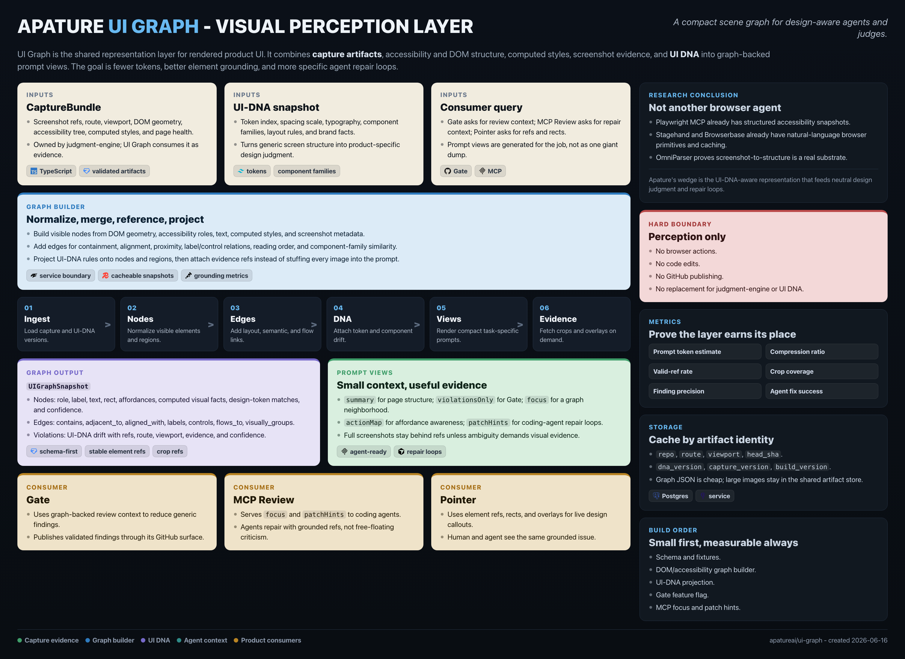

# Apature UI Graph

Token-efficient, UI-DNA-aware visual perception for Apature agents.

Apature UI Graph turns a rendered product screen into a compact scene graph: elements, layout relationships, affordances, visual facts, design-token matches, and UI-DNA drift. It gives Gate, Pointer, MCP Review, and future agent surfaces a shared way to understand what is on screen without stuffing full screenshots, DOM dumps, and design-system prose into every model call.

This is not the main YC wedge. `apatureai/gate` remains the startup MVP repo. UI Graph is a shared moat layer that makes Apature's review and agent products cheaper, more grounded, and more consistent over time.

## What This Repo Is

This repo owns the specification for Apature's rendered-UI representation layer:

- The `UIGraphSnapshot` schema.
- Graph construction from capture bundles, accessibility trees, DOM geometry, computed styles, screenshots, and UI DNA.
- Prompt views for agents and judges.
- Token-efficiency and grounding metrics.
- Research on current browser-agent, visual-grounding, and screen-parsing approaches.

It does not own browser capture, model calls, evaluation, feedback storage, or customer-facing GitHub delivery. Those live in `apatureai/judgment-engine` and product repos such as `apatureai/gate`.

## Docs

- [RESEARCH.md](RESEARCH.md) - source-backed market and technical research.
- [PRD.md](PRD.md) - product requirements and sequencing.
- [TRD.md](TRD.md) - build-ready technical requirements.
- [ARCHITECTURE.md](ARCHITECTURE.md) - diagrams, data flow, repo boundaries, and failure modes.
- [ui_graph_architecture.png](ui_graph_architecture.png) - one-page architecture poster.
- [poster_ui_graph.html](poster_ui_graph.html) - editable source for the poster.

## Product Boundary

UI Graph provides perception, references, and compressed context. It does not browse, click, type, edit code, or publish product reviews. The action boundary stays with the consumer:

- Gate decides when a PR review runs and where findings are published.
- Pointer decides how a live reviewer points at the rendered UI.
- MCP Review decides how an agent asks for evidence and suggestions.
- Judgment Engine owns capture, Qwen3-VL calls, validation, eval, feedback primitives, and shared security.

## Current MVP Focus

The first useful version should make one internal workflow better:

1. `judgment-engine` captures a route and emits a `CaptureBundle`.
2. `ui-dna` provides the current design genome.
3. UI Graph builds a compact graph of the rendered screen.
4. Gate or MCP Review asks for a prompt view such as `violationsOnly` or `focus(elementRefs)`.
5. The judge or coding agent receives grounded element references, concise visual facts, and only the screenshots/crops it needs.

## Architecture

